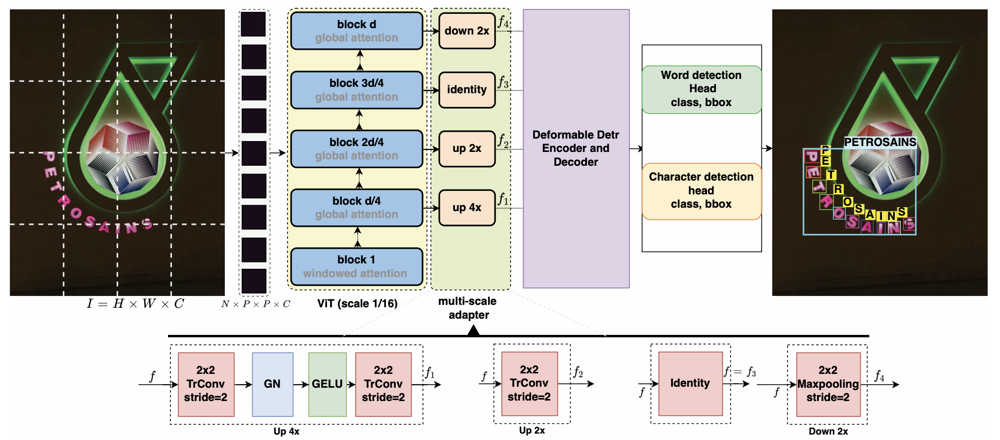

# Occluded Text Detection and Recognition in the Wild


Official implementation of Occluded text detection and recognition in the wild paper | [Paper](https://ieeexplore.ieee.org/abstract/document/9867061/) | [Pretrained Model]() | [Dataset](https://www.dropbox.com/scl/fi/vgool6x0wx2pcbp0czc9n/OCTT.zip?rlkey=wv1vlndavxm8k2ion1c70iuhq&dl=0) | [PPT]()

**[Zobeir Raisi](https://github.com/zobeirraisi) and John Zelek**

University of Waterloo, Canada.

In [2022 19th Conference on Robots and Vision (CRV)](https://www.computerrobotvision.org/)

## Abstract

The performance of existing deep-learning scene text recognition-based methods fails significantly on occluded text instances or even partially occluded characters in a text due to their reliance on the visibility of the target characters in images. This failure is often due to features generated by the current architectures with limited robustness to occlusion, which opens the possibility of improving the feature extractors and/or the learning models to better handle these severe occlusions. In this paper, we first evaluate the performance of the current scene text detection, scene text recognition, and scene text spotting models using two publicly-available occlusion datasets: Occlusion Scene Text (OST) that is designed explicitly for scene text recognition, and we also prepare an Occluded Character-level using the Total-Text (OCTT) dataset for evaluating the scene text spotting and detection models. Then we utilize a very recent Transformer-based framework in deep learning, namely Masked Auto Encoder (MAE), as a backbone for scene text detection and recognition pipelines to mitigate the occlusion problem. The performance of our scene text recognition and end-to-end scene text spotting models improves by transfer learning on the pre-trained MAE backbone. For example, our recognition model witnessed a 4% word recognition accuracy on the OST dataset. Our end-to-end text spotting model achieved 68.5% F-measure performance outperforming the stat-of-the-art methods when equipped with an MAE backbone compared to a convolutional neural network (CNN) backbone on the OCTT dataset.


## OCTT Dataset:

Download the dataset from the following link:
[link](https://url.au.m.mimecastprotect.com/s/7sALCBNq2xF7E969ntzfkC2Uj-v?domain=dropbox.com)

## Getting started
### Installation
```

```

#### Linux
```
```

### Training
```
```
### Evaluation
```
```
### Inference
```
```

## Overview
<p align="center">
  
  <br>
  <b>Figure. Overall architecture</b>
</p>

### Results

| Model | IIIT5K | SVT | IC03 | IC13 | IC15 | SVTP | CT80 |
|:-----:|:------:|:---:|:----:|:----:|:----:|:----:|:----:|
| Proposed Model() | |  |  |  |  |  |  |
| Proposed Model() |  |  |  |  |  |  |  |

## Citation
```
@INPROCEEDINGS{9867061,
  author={Raisi, Zobeir and Zelek, John},
  booktitle={2022 19th Conference on Robots and Vision (CRV)}, 
  title={Occluded Text Detection and Recognition in the Wild}, 
  year={2022},
  volume={},
  number={},
  pages={140-150},
  doi={10.1109/CRV55824.2022.00026}}
```

## License
```

```
