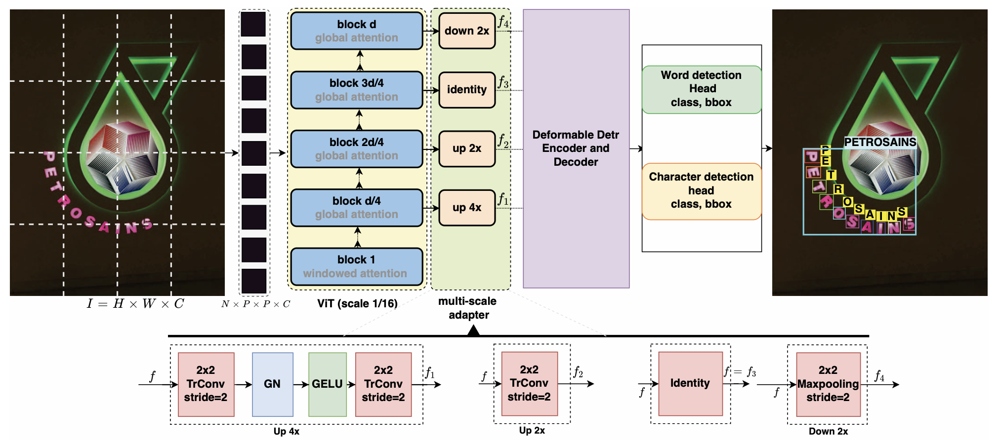

# Occluded Text Detection and Recognition in the Wild

Official repository for the paper **"Occluded Text Detection and Recognition in the Wild"**, introducing the **OCTT** dataset — an occluded, character-level annotated version of Total-Text for benchmarking scene text detection, recognition, and spotting under occlusion.

[](https://ieeexplore.ieee.org/abstract/document/9867061/)
[](https://doi.org/10.5281/zenodo.21124656)
[](LICENSE)

**[Zobeir Raisi](https://github.com/zobeirraisi)** and **John Zelek**

University of Waterloo, Canada

Published in [2022 19th Conference on Robots and Vision (CRV)](https://www.computerrobotvision.org/)

## Abstract

The performance of existing deep-learning scene text recognition-based methods fails significantly on occluded text instances or even partially occluded characters in a text due to their reliance on the visibility of the target characters in images. This failure is often due to features generated by the current architectures with limited robustness to occlusion, which opens the possibility of improving the feature extractors and/or the learning models to better handle these severe occlusions. In this paper, we first evaluate the performance of the current scene text detection, scene text recognition, and scene text spotting models using two publicly-available occlusion datasets: Occlusion Scene Text (OST), designed explicitly for scene text recognition, and we also prepare an Occluded Character-level dataset using Total-Text (OCTT) for evaluating scene text spotting and detection models. We then utilize a very recent Transformer-based framework in deep learning, namely Masked Auto Encoder (MAE), as a backbone for scene text detection and recognition pipelines to mitigate the occlusion problem. The performance of our scene text recognition and end-to-end scene text spotting models improves through transfer learning on the pre-trained MAE backbone. For example, our recognition model achieved a 4% word recognition accuracy improvement on the OST dataset. Our end-to-end text spotting model achieved 68.5% F-measure, outperforming state-of-the-art methods when equipped with an MAE backbone compared to a convolutional neural network (CNN) backbone on the OCTT dataset.

## Overview

<p align="center">
  
  <br>
  <b>Figure. Overall architecture</b>
</p>

## OCTT Dataset

OCTT is built on top of [Total-Text](https://github.com/cs-chan/Total-Text-Dataset), adding synthetically occluded versions of each image/crop for both:
- **Detection** — full scene images with occlusions (`detection/`)
- **Recognition** — cropped word instances, occluded and original, with LMDB packaging scripts (`recognition/total-text-cropped/`)

Download:
- [Zenodo](https://doi.org/10.5281/zenodo.21124656) (recommended, versioned & citable)
- [Dropbox mirror](https://www.dropbox.com/scl/fi/vgool6x0wx2pcbp0czc9n/OCTT.zip?rlkey=wv1vlndavxm8k2ion1c70iuhq&dl=0)

Detection annotations follow the original Total-Text annotation format.

## Getting Started

> **Note:** Training/inference code for this paper has not been released in this repository yet. This section is a placeholder — see the [Citation](#citation) below if you want to cite the method in the meantime.

### Installation
```bash
# TODO: add environment setup once code is released
```

### Training
```bash
# TODO
```

### Evaluation
```bash
# TODO
```

### Inference
```bash
# TODO
```

## Results

<!-- TODO: fill in with the numbers from the paper -->
| Model | IIIT5K | SVT | IC03 | IC13 | IC15 | SVTP | CT80 |
|:-----:|:------:|:---:|:----:|:----:|:----:|:----:|:----:|
| Proposed Model | | | | | | | |

Pretrained models: TODO
Slides: TODO

## Citation

If you use OCTT or this work in your research, please cite:

```bibtex
@INPROCEEDINGS{9867061,
  author={Raisi, Zobeir and Zelek, John},
  booktitle={2022 19th Conference on Robots and Vision (CRV)},
  title={Occluded Text Detection and Recognition in the Wild},
  year={2022},
  volume={},
  number={},
  pages={140-150},
  doi={10.1109/CRV55824.2022.00026}}
```

## License

Code in this repository is released under the [MIT License](LICENSE). The OCTT dataset is derived from Total-Text; please also respect the [Total-Text license](https://github.com/cs-chan/Total-Text-Dataset) terms.
